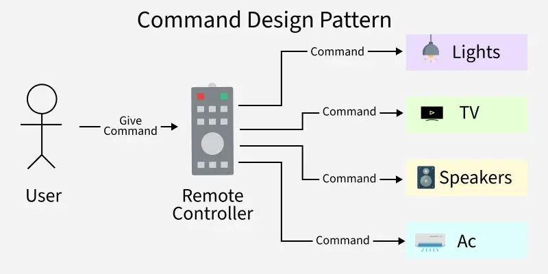
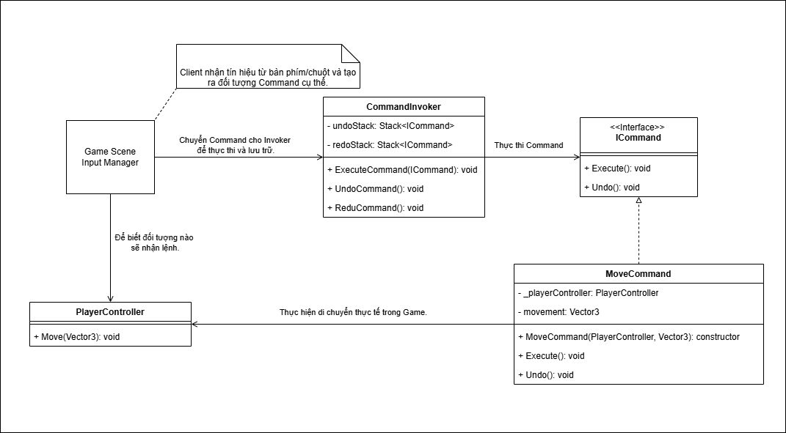

# Command Design Pattern

## Định nghĩa

The **Command Design Pattern** is a behavioral design pattern that **encapsulates a request as an object**, thereby decoupling the **invoker (sender)** of the request from the receiver and allowing flexible execution of operations.
It turns a request (like pressing a remote button) into an object so **it can be passed, stored, queued, or undone easily**.

## Ví dụ ứng dụng

- Trong các trò chơi cờ (Cờ vua, cờ tướng,...), **Command Design Pattern** được sử dụng để đóng gói mỗi nước đi thành một command object, cho phép dễ dàng thực hiện Undo/Redo thông qua việc lưu trữ các command trong Undo Stack và Redo Stack.

- Khi người chơi lần lượt chọn các điểm A → B → C, mỗi hành động di chuyển được đóng gói thành một command và đưa vào Queue. Các command này được thực thi tuần tự, giúp tách biệt logic điều khiển (input) và hành vi thực thi (movement).

## Thành phần

Tôi sẽ dùng trò chơi có chức năng Undo và Redo để làm ví dụ thực tế.

1. **[Command Interface](./Scripts/ICommand.cs)**: Khai báo các chức năng chung. Ví dụ: Execute(), Undo(),...
2. **[Concrete Commands](./Scripts/MoveCommand.cs)**: Triển khai/làm rõ Interface đã tạo ra trước đó. Ví dụ MoveCommand đóng gói hành động di chuyển của nhân vật theo một vector xác định, Execute thực hiện di chuyển, còn Undo di chuyển ngược lại để hoàn tác hành động.
3. **[Invoker](./Scripts/CommandInvoker.cs)**: Người quản lý và ra lệnh thực hiện. Nó là nơi lưu trữ Stack hoặc Queue và gọi hàm Execute().
4. **[Receiver](./Scripts/PlayerController.cs)** Thực hiện các thao tác nhận được bởi lệnh điều khiển.

