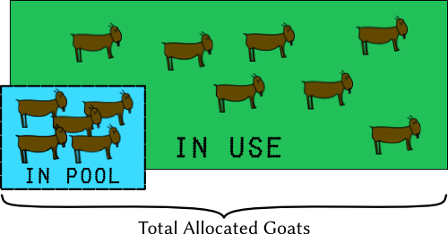

# Object Pool Design Pattern

## Định nghĩa

The **Object Pool Design Pattern** is a creational design pattern that **reuses objects from a pre-allocated pool** instead of creating and destroying them repeatedly.
It **improves performance** by reducing the overhead of memory allocation and preventing garbage collection spikes, especially in games with many short-lived objects.

## Ví dụ ứng dụng

- Trong các trò chơi bắn súng, thay vì Instantiate một viên đạn mới và Destroy nó khi va chạm, ta lấy viên đạn từ Pool ra và trả lại Pool khi dùng xong.

- Các hiệu ứng cháy nổ, máu văng xuất hiện liên tục có thể được quản lý bằng Pool để giữ Frame Rate ổn định.

- Trong các game thể loại "Survivor" hoặc "Tower Defense" với số lượng quái vật lớn, việc tái sử dụng Object giúp giảm tải cho bộ nhớ.

## Thành phần

1. **[Object Pool:](./Scripts/ObjectPool.cs)** Đóng vai trò là "Kho lưu trữ" và Cung cấp các phương thức như Get() (lấy một Object đang rảnh) và Return() (thu hồi Object về kho sau khi dùng xong).
2. **[Poolable Object:](./Scripts/RainObject.cs)** Đối tượng được quản lý bởi Pool (Prefab).
3. **[Requester/Spawner:](./Scripts/RainObjectManager.cs)** Đối tượng có nhu cầu sử dụng. Thay vì gọi Instantiate(), nó sẽ yêu cầu Pool Manager cung cấp một Object.
