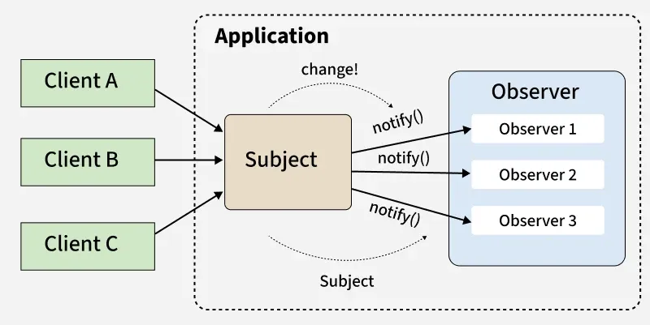

# Observer Design Pattern

## Định nghĩa

**Observer Design Pattern** is a behavioral pattern that **creates a one-to-many relationship** between a subject and its observers. When **the subject's state changes, all dependent observers are notified** and updated automatically, ensuring synchronized communication.

## Ví dụ ứng dụng

- Hệ thống UI (Health Bar, Score Text): Khi nhân vật nhận sát thương, thay vì nhân vật phải gọi trực tiếp đến từng thanh máu hay text điểm, nó chỉ cần phát một sự kiện "HealthChanged". Các thành phần UI sẽ tự đăng ký lắng nghe và cập nhật chính nó.

- Hệ thống Thành tựu: Khi người chơi đạt một mốc nhất định (ví dụ: giết 100 quái vật), hệ thống Achievement sẽ nhận được thông báo từ hệ thống Gameplay để mở khóa danh hiệu mà không làm rối mã nguồn của logic chiến đấu.

- Quest System: Lắng nghe các hành động của người chơi để cập nhật tiến trình nhiệm vụ một cách tự động.

## Thành phần

1. **[Subject/Global Observer:](./Scripts/Observer.cs)** Đóng vai trò là "tổng đài" trung tâm, lưu trữ tất cả các kênh sự kiện và cung cấp các phương như Add, Remove, Notify để mọi đối tượng trong Game có thể truy cập mà không cần tham chiếu trực tiếp.
2. **[Listener/Observer:](./Scripts/DemoLoger.cs)** Lắng nghe sự kiện cụ thể. Thực hiện logic phản hồi (như cập nhật UI, Log dữ liệu) khi nhận được callback từ tổng đài. Luôn nhớ gọi RemoveListener trong hàm OnDestroy() hoặc OnDisable() của Listener. Nếu không, Observer sẽ tiếp tục giữ tham chiếu đến đối tượng đã bị xóa, dẫn đến rò rỉ bộ nhớ (Memory Leak).
3. **[Publisher:](./Scripts/ObserverInputManager.cs)** Đối tượng phát đi thông báo/gửi dữ liệu đi mà không cần quan tâm ai sẽ nhận dữ liệu đó.
